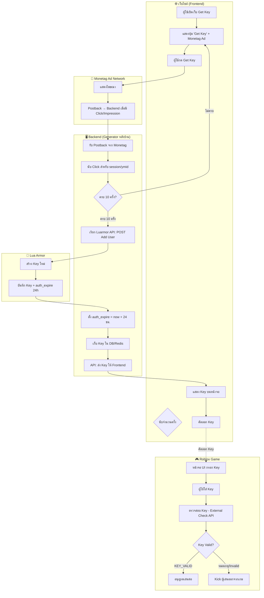
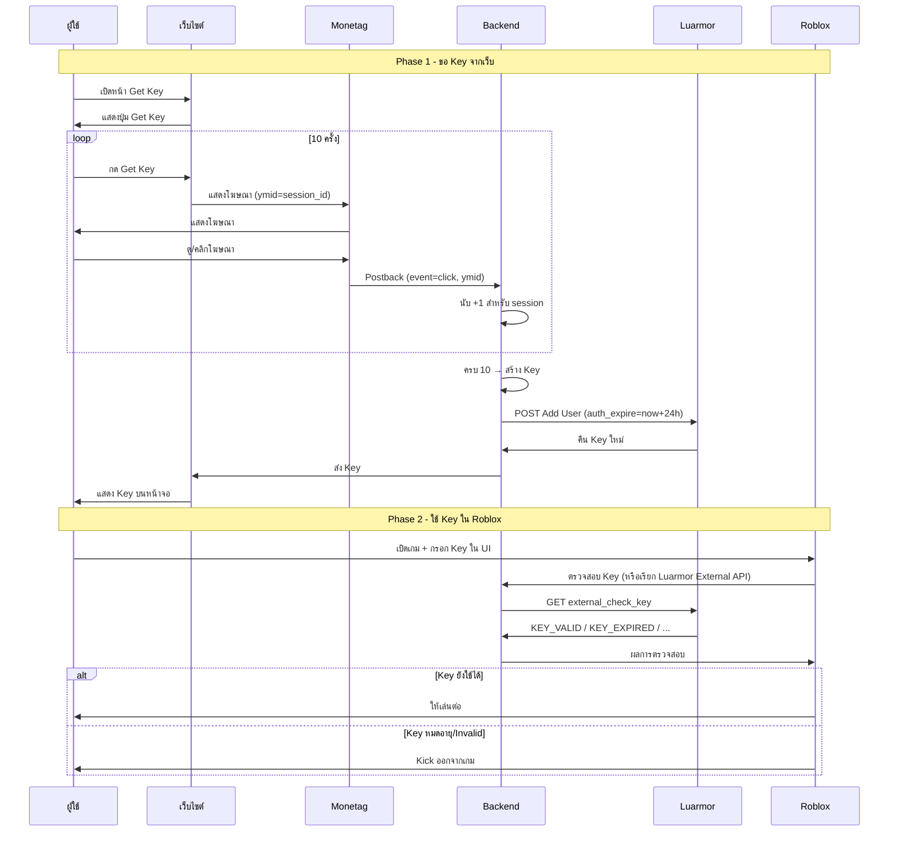

# Flow Diagram: Lua Armor Whitelist + Monetag Ads + Backend Generator + Roblox UI

## ภาพรวมระบบ

ระบบที่ใช้:
- **Monetag** – แสดงโฆษณา on เว็บ | ผู้ใช้กด "Get Key" 10 ครั้ง → ได้ key 24 ชม.
- **Backend ของคุณ** – Generator ทำหน้าที่สร้าง key ผ่าน Luarmor API
- **Luarmor** – Whitelist/Key validation สำหรับ script ใน Roblox
- **Roblox UI** – กรอก key จากเว็บ → ถ้า key หมดอายุ → kick ออกจากเกม

---

## Flow Diagram (Mermaid)



---

## Sequence Diagram (รายละเอียดขั้นตอน)



---

## สถาปัตยกรรมของระบบ

```
┌─────────────────────────────────────────────────────────────────────────┐
│                         YOUR INFRASTRUCTURE                              │
├─────────────────────────────────────────────────────────────────────────┤
│                                                                         │
│  ┌──────────────┐     ┌──────────────┐     ┌──────────────────────────┐ │
│  │   WEBSITE    │     │   BACKEND    │     │   DATABASE / REDIS        │ │
│  │   (Frontend) │     │   (Node/PHP/ │     │   - session_id → count    │ │
│  │              │     │    Python)   │     │   - session_id → key      │ │
│  │ - Monetag    │────▶│              │────▶│   - key → expires_at      │ │
│  │   SDK/Ads    │     │ - Postback   │     └──────────────────────────┘ │
│  │ - Get Key    │     │   handler    │                ▲                 │
│  │   button     │     │ - Luarmor    │                │                 │
│  └──────────────┘     │   API client │                │                 │
│         │             └──────┬───────┘                │                 │
│         │                    │                        │                 │
└─────────┼────────────────────┼────────────────────────┼─────────────────┘
          │                    │                        │
          │                    ▼                        │
          │             ┌──────────────┐                │
          │             │   LUARMOR    │                │
          │             │   - Add User │                │
          │             │   - Key Gen  │                │
          │             │   - Validate │                │
          │             └──────────────┘                │
          │                    ▲                        │
          │                    │                        │
┌─────────┼────────────────────┼────────────────────────┼─────────────────┘
│         │                    │                        │
│  ┌──────┴──────┐     ┌───────┴───────┐                │
│  │  MONETAG    │     │   ROBLOX      │                │
│  │  Ad Network │     │   - UI Key    │────────────────┘
│  │  Postback   │     │   - Validate  │   (ตรวจสอบ key ผ่าน backend)
│  └─────────────┘     │   - Kick      │
│                      └───────────────┘
│
└─────────────────────────────────────────────────────────────────────────┘
```

---

## สิ่งที่ต้องเตรียม

### 1. Monetag
- สมัคร Monetag และสร้าง Zone
- ขอเปิด **Postback** กับ Monetag support
- Postback URL: `https://yourdomain.com/api/postback?ymid={ymid}&event={event_type}`
- SDK บนเว็บ: ใช้ `ymid` = session_id หรือ user_id เพื่อ track ว่าใครกดครบ 10 ครั้ง

### 2. Luarmor
- Whitelist IP ของ backend บน Luarmor dashboard
- Luarmor HTTP API สำหรับ **Add User** (สร้าง key)
- Luarmor 3rd Party External Key Check API สำหรับตรวจสอบ key ใน Roblox (ต้องขอ approval จาก federal)

### 3. Backend (Generator)
- **Postback handler**: รับ Monetag postback, นับ click ต่อ session
- **Key generation**: เมื่อครบ 10 ครั้ง → POST Luarmor API สร้าง key พร้อม `auth_expire = now + 86400` (24 ชม.)
- **Validate API**: endpoint ให้ Roblox เรียกเช็ค key (อาจเรียก Luarmor External Check ต่อ)

### 4. Roblox
- UI สำหรับกรอก key
- Remote/HTTPService เรียก backend เพื่อ validate key
- ตารางตรวจสอบ key เป็นระยะ (เช่นทุก 5–10 นาที) ถ้า expired ให้ kick

---

## จุดที่ต้องระวัง

| หัวข้อ | รายละเอียด |
|--------|-------------|
| Monetag Postback | ต้องติดต่อ support เพื่อเปิดใช้ ไม่มีใน self-service |
| Luarmor 3rd Party API | ต้องขอ project approval และ shared secrets จาก federal |
| HWID | Key จาก Luarmor จะ lock กับ HWID เมื่อมีการใช้ครั้งแรก (ถ้าใช้ External Check API) |
| Session | ใช้ `ymid` หรือ session_id ให้สอดคล้องกันทั้ง Monetag, backend และ frontend |

---

## ตัวอย่าง Logic (Pseudo-code)

### Backend – Postback Handler
```python
# เมื่อ Monetag ส่ง postback มา
@app.get("/api/postback")
def postback(ymid, event_type):
    if event_type == "click":
        count = redis.incr(f"ad_clicks:{ymid}")
        if count >= 10:
            key = create_luarmor_key(auth_expire=now() + 86400)  # 24h
            redis.set(f"key:{ymid}", key, ex=86400)
            redis.delete(f"ad_clicks:{ymid}")  # reset
    return 200
```

### Roblox – Validate + Kick เมื่อหมดอายุ
```lua
-- ตรวจสอบ key เป็นระยะ
local function checkKeyExpired()
    local result = game:GetService("HttpService"):GetAsync(
        "https://yourdomain.com/api/validate?key=" .. playerKey
    )
    if result.valid == false then
        game.Players.LocalPlayer:Kick("Key หมดอายุ กรุณาขอ Key ใหม่ที่เว็บ")
    end
end
task.spawn(function()
    while true do
        checkKeyExpired()
        task.wait(300)  -- เช็คทุก 5 นาที
    end
end)
```

---

*สร้าง Flow Diagram นี้เพื่ออธิบายการเชื่อมต่อ Luarmor + Monetag + Backend + Roblox UI*
